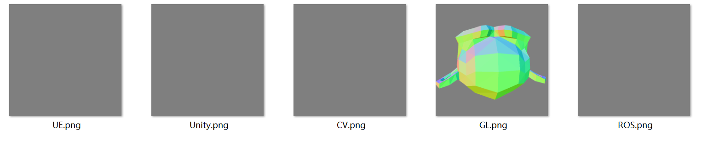
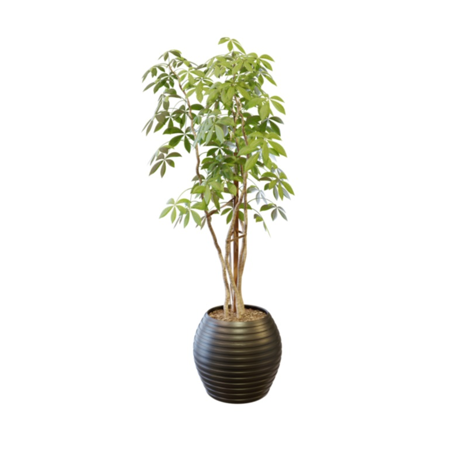
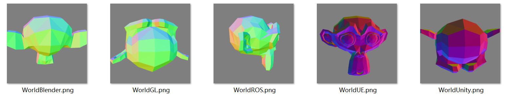

Tutorial
========

In this tutorial, we will go through the basic functionality in Calibur by solving several common scenarios.

Definition of Pose
------------------

In Calibur (and most modern CG/CV systems), a pose is defined as a homogeneous-coordinate transform matrix.
A point, or a small object at local position :math:`p = (x, y, z)^T`,
attached to a parent object with pose :math:`A` has the world position

.. math::
    
    \hat{p_w} = A \hat{p},

where :math:`\hat{p} = (x, y, z, 1)^T` is the homogeneous coordinates.
We divide the first three coordinates by the fourth to obtain the :math:`(x, y, z)` positions
from a homogeneous-coordinate vector.

Convert between Conventions
---------------------------

Different systems assume different axes conventions for cameras.
That is to say, in the local cartesian coordinate system of cameras, the same axis (*X/Y/Z*) may
refer to different physical directions of the camera.

For example, in OpenGL, we assume *-Z* as the forward direction of camera (looking into the screen),
while *+Y* is up and *+X* is right.
In comparison, in Unity we use a left-handed system and *+Z* is the camera forward direction.
While in OpenCV, *+Z* is forward and *-Y* is up;
ROS uses a very different system where *+X* is forward, *+Z* is up and thus *-Y* is right.

If we want to render a scene in OpenGL with a camera pose obtained with OpenCV, you have to convert it.

A camera pose transforms *xyz* point coordinates relative to the camera into *xyz* coordinates in the world.
By *converting*, we mean that a point in the world will remain at
the same relative physical position to the camera, with the same right, up and forward offsets.
The same right, up and forward offsets can mean different *xyz* coordinates in two systems.

In other words, given a camera pose in system A, we find a pose in system B that represents
the same camera viewing the same things.

In Calibur, this can be done with the :py:func:`calibur.convert_pose` function.

.. code-block::

    import numpy
    import calibur
    from calibur import CC  # short for `CameraConventions`

    campose_gl = numpy.array([
        [0.6859206557273865, -0.32401347160339355, 0.6515582203865051, 7.358891487121582],
        [0.7276763319969177, 0.305420845746994, -0.6141703724861145, -6.925790786743164],
        [0.0, 0.8953956365585327, 0.44527140259742737, 4.958309173583984],
        [0.0, 0.0, 0.0, 1.0]
    ])
    campose_cv = calibur.convert_pose(campose_gl, CC.GL, CC.CV)
    # array([[ 0.68592066,  0.32401347, -0.65155822,  7.35889149],
    #        [ 0.72767633, -0.30542085,  0.61417037, -6.92579079],
    #        [ 0.        , -0.89539564, -0.4452714 ,  4.95830917],
    #        [ 0.        ,  0.        ,  0.        ,  1.        ]])

Check :py:class:`calibur.CameraConventions` for more conventions recorded in calibur.

Detect and Debug Conventions of a Camera
----------------------------------------

When you have a set of camera pose matrix and intrinsics from some random sort of source,
we may usually want to know what convention it is in.
If we can expect the cameras to see something (for example, we know it is orbital looking at the world origin),
we can detect the convention by rendering images assuming different conventions.

A simple NumPy-based raytracer is built into Calibur and can be utilized for this purpose.

Another case is when you have a target convention
(e.g. you are going to send the parameters into Blender or OpenCV),
you want to debug or check if your parameters are correct.
This can also be done by the technique introduced in this section.

For example: in the NeRF-synthetic dataset, we know that cameras are orbital cameras
and lies in the upper-hemisphere.

As we need to save images, to run the example you need to install ``matplotlib``.

.. code-block::

    import numpy
    import calibur
    from calibur import CC, WorldConventions
    import matplotlib.pyplot as plotlib

    # Input from NeRF-Synthetic dataset, `ficus` scene
    pose = numpy.array([
        [-9.90379214e-01, -2.33055409e-02,  1.36404201e-01, 5.49862862e-01],
        [ 1.38380826e-01, -1.66795656e-01,  9.76232648e-01, 3.93531919e+00],
        [-1.86264537e-09,  9.85715985e-01,  1.68415993e-01, 6.78906500e-01],
        [ 0.00000000e+00,  0.00000000e+00,  0.00000000e+00, 1.00000000e+00]
    ], dtype=numpy.float32)  # use float32 to be faster (default is float64)
    fov = 0.6911112070083618  # in radians, about 39.6 degrees
    w = h = 800  # in pixels

    # compute intrinsic parameters from given input
    focal_length = calibur.fov_to_focal(fov, w)
    principal = w // 2  # camera focus is at image center
    fx = fy = focal_length
    cx = cy = principal

    # use a blender Suzanne monkey head mesh for debugging
    # the mesh is centered around the world origin
    rp = calibur.SimpleRayTraceRP().set_geometry(calibur.resources.get_monkey())

    for name, cam_conv in zip(
        ["GL", "CV", "ROS", "Unity", "UE"],
        [CC.GL, CC.CV, CC.ROS, CC.Unity, CC.UE]
    ):
        # render pipeline of calibur assume OpenCV camera pose
        cam_cv = calibur.convert_pose(pose, cam_conv, CC.CV)
        # render world-space normals
        shade_env = calibur.NormalCaptureEnvironment()
        plotlib.imsave(
            f"{name}.png",
            rp.render(shade_env, cam_cv, fx, fy, cx, cy, w, h)
        )

After running the code, you will see a bunch of images in your directory:

It is clear that the pose is only valid under the GL convention.
In fact, the pose was obtained with Blender, which uses the same camera convention as GL
(see :py:attr:`calibur.CameraConventions.Blender`). Eureka!

However, there still seems to be something wrong. Let's look at the given ficus image:

The rendered monkey head does not look to be in a similar pose.
This is due to the mismatch in the world convention.

When it comes to the world convention, it is trickier as:

1. While the world gravity axis can be uniquely identified,
   the forward and right axis are symmetric for most content.
   For example, you cannot tell if the plant above is showing the frontal or profile view.
2. For orbital cameras, flipping the camera convention up axis has the same effect
   as flipping the world up axis.
   This is to say, there are equivalent camera/world convention pairs in this case.

Fortunately, for most (if not all) applications in CG/CV, as long as you are consistent
with yourselves when coding, these equivalences would not cause any problem.
For example, if you flipped the right and forward world axes in NeRF, SfM or any other reconstruction systems,
they would simply reconstruct an object with a different orientation,
and the final results would be exactly the same.
If you flipped both the camera up and world up when rendering with orbital cameras,
the results would also be exactly the same.

We may run the same technique to detect the world convention:

.. code-block::

    for name, world_conv in zip(
        ["GL", "Blender", "ROS", "Unity", "UE"],
        [WorldConventions.GL, WorldConventions.Blender, WorldConventions.ROS, WorldConventions.Unity, WorldConventions.UE]
    ):
        # we know that the camera is in the GL convention!
        cam_cv = calibur.convert_pose(pose, CC.GL, CC.CV)
        # the Suzanne head mesh is in GL conventions
        # thus you can only apply poses in GL conventions!
        # We want to apply a transform in GL such that
        # it is the identity in the target world convention.
        model_pose = calibur.convert_pose(numpy.eye(4, dtype=numpy.float32), world_conv, WorldConventions.GL)
        # apply the model pose to the model
        rp.set_geometry(calibur.transform_point(calibur.resources.get_monkey(), model_pose))
        plotlib.imsave(
            f"World{name}.png",
            rp.render(calibur.NormalCaptureEnvironment(), cam_cv, fx, fy, cx, cy, w, h)
        )

Blender, ROS and UE are all valid for this scene (with Blender as the ground truth)
as you cannot tell between the back, side and front for the ficus.
All would work for the reconstruction scenario.

Another take-away message as shown in the example code comments:

    Object poses should be in (or converted to) the same convention as the object geometry (mesh) assumes.

Projection and Viewport Transforms
----------------------------------

Apart from camera (view) and world spaces, we have various "fictional" spaces that we commonly
use in graphics or vision pipelines, including NDC (normalized device coordinates) space,
clip space, viewport spaces; on the *Z* dimension we have GL-Z, 0-1 depth and linear depth; etc.

Calibur also provide routes through these spaces. Let's see an example that arrives in
viewport XY coordinates from random vertices in the world via two different approaches:

1. | World-space coordinates
   | -> GL view matrix -> GL camera space
   | -> GL projection matrix -> GL NDC space
   | -> Viewport transform, GL-to-DX viewport -> DX viewport space.
2. | World-space coordinates
   | -> OpenCV extrinsic matrix -> OpenCV camera space
   | -> OpenCV intrinsic matrix -> OpenCV viewport space (homogeneous coordinate).

..

    GL viewport space has bottom-left origin, while OpenCV and DX viewport space has top-left origin.

.. code-block::

    import numpy
    import calibur
    from calibur import CC

    pts = numpy.random.randn(128, 3)
    cam_pose = numpy.array([
        [0.6859206557273865, -0.32401347160339355, 0.6515582203865051, 7.358891487121582],
        [0.7276763319969177, 0.305420845746994, -0.6141703724861145, -6.925790786743164],
        [0.0, 0.8953956365585327, 0.44527140259742737, 4.958309173583984],
        [0.0, 0.0, 0.0, 1.0]
    ])  # GL camera
    r = 256  # resolution, or width and height
    cx, cy = 100, 200  # principal point
    f = 300  # focal length
    
    view_mtx = numpy.linalg.inv(cam_pose)
    pts_v = calibur.transform_point(pts, view_mtx)
    p_mtx = calibur.projection_gl_persp(r, r, cx, cy, f, f, 0.1, 100.0)
    pts_ndc = calibur.transform_point(pts_v, p_mtx)
    vp_1 = calibur.gl_ndc_to_dx_viewport(pts_ndc, r, r)
    
    cam_pose_cv = calibur.convert_pose(cam_pose, CC.GL, CC.CV)
    extrinsics_cv = numpy.linalg.inv(cam_pose_cv)
    intrinsics_cv = calibur.intrinsic_cv(cx, cy, f, f)
    vp_2 = calibur.transform_point(pts, extrinsics_cv) @ intrinsics_cv.T

    vp_1 = calibur.GraphicsNDArray(vp_1)
    vp_2 = calibur.GraphicsNDArray(vp_2)
    assert numpy.allclose(vp_1.xy, vp_2.xy / vp_2.z)

..

    GraphicsNDArray is an extension to numpy arrays in calibur to provide GLSL-like
    syntax visiting the last dimension easier.

Conclusion
----------

Congratulations! You have reached the end of the Calibur tutorial.
We have covered topics spanning converting between conventions,
detecting, debugging and transforms between various spaces.
You can visit :doc:`generated/calibur` for detailed API references.
